## ZASTOSOWANIE NAUCZANIA MASZYNOWEGO W TRANSPORCIE MIEJSKIM

### [Aplikacja typu Mobilny System Informacji Pasażerskiej](https://github.com/dkotowicz/praca_magisterska/tree/master/react_native_application)
Aplikacja jest tworzona w technologii *React Native* przy użyciu skryptowego język programowania *JavaScript*. Framework *React Native* jest udostępniany bezpłatnie na licencji MIT.

#### Opis aplikacji

Na ekranie powitalnym do spodu ekranu sa przypięte trzy menu główne: **Odjazdy**, **Historia** oraz **Mapa**. W widoku **Odjazdy** widnieją dwa przyciski: **Rozkład przystanków** oraz **Rozkład linii**.

  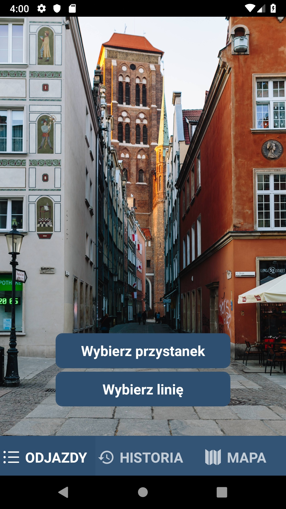
  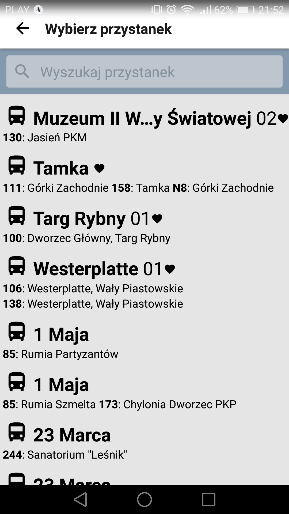 
  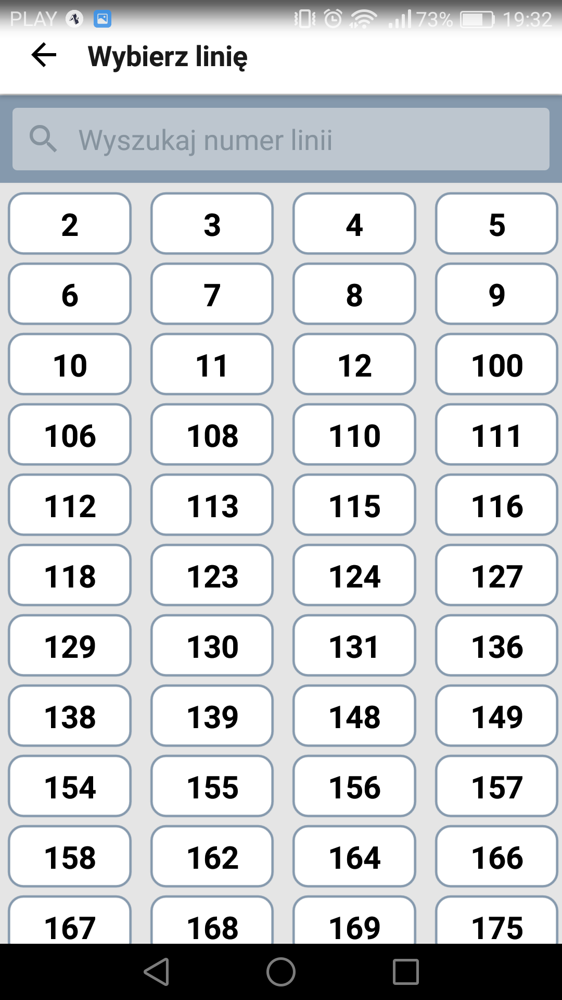 

Po kliknięciu **Wybierz przystanek** przekieruje nas do widoku, w którym jest wyświetlana lista przystanków. Każdy przystanek jest oznaczony: *ikoną* autobusu lub tramwaju, określającą obsługiwany rodzaj pojazdów; *nazwą przystanku*; *numerem identyfikującym* przystanki o tej samej nazwie oraz ewentualnie ikoną *serduszka*, jeśli został dodany do ulubionych. Pod nazwą każdego przystanku widnieje lista linii obsługujących ten przystanek, wraz z kierunkiem.

Po kliknięciu **Wybierz linię** zostaniemy przekierowani do widoku, w którym w postaci kafelek wyświetlana jest lista linii obsługiwanych przez ZTM w Gdańsku.

Do obu widoków jest przypięty panel wyszukiwania.

  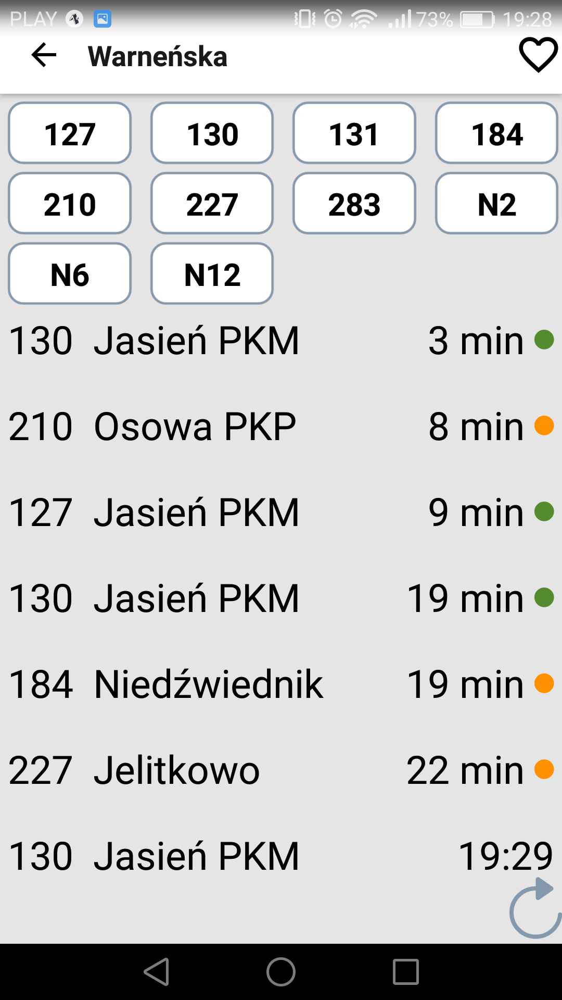
  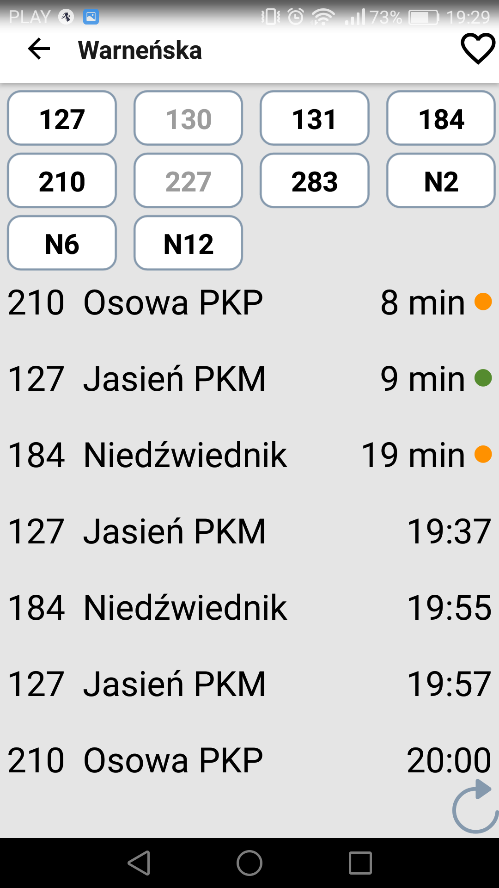 

Po wyborze określonego przystanku z listy *Wybierz przystanek* przechodzimy do widoku, w którym wyświetlane są chronologicznie czasy odjazdów, w postaci: **LINIA KIERUNEK CZAS**, np. 110 Port Lotniczy 12:00. Czas wyświetlany w formacie hh:mm jest czasem statycznym - według rozkładu jazdy. Ponadto, aplikacja łączy się z serwerem ZTM i dla danego przystanku pobiera rzeczywiste czasy odjazdu według systemu Tristar. Czasy dynamiczne są oznaczone jako: za **X min**. Dla linii, oraz odcinków, które są tematem tej pracy aplikacja będzie dodatkowo wyświetlać czasy przewidziane przez Sieć Neuronową. Użytkownik będzie miał możliwość porównania wartości zwracanych przez Tristar i SN. Dane o SN możemy zobaczyć po wyborze linii z listy odjazdów. 

Na górze widoku widnieje w postaci przycisków lista linii, które odjeżdżają z tego przystanku. Użytkownik klikając daną linię, ma możliwość odznaczyć nieinteresujące go linie, dzięki czemu nie będą one wyświetlane na liście odjazdów.

Dodatkowo dla czasów dynamicznych wyświetlany jest kolorowy wskaźnik określający opóźnienie względem rozkładu jazdy.
-  opóźnienie poniżej 2 minut
-  opóźnienie od 2 do 5 minut
-  opóźnienie od 5 do 10 minut
-  opóźnienie powyżej 10 minut

Przy nazwie przystanku widnieje obrys serduszka. Po jej kliknięciu ikonka się zapełni i tym samym przystanek zostanie dodany do ulubionych. Ulubiony przystanek jest oznaczony serduszkiem na liście przystanków oraz jest wyświetlany na szczycie listy, również w przypadku użycia opcji wyszukaj - jeśli spełnia kryteria.

Widok można odświeżyć za pomocą pociągnięcia listy w dół lub kliknięciem przycisku odśwież w prawym, dolnym rogu ekranu. 

  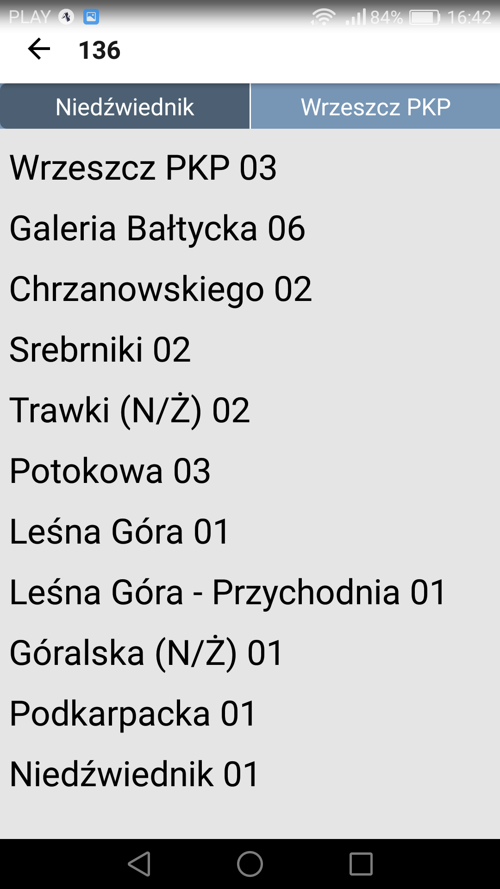
  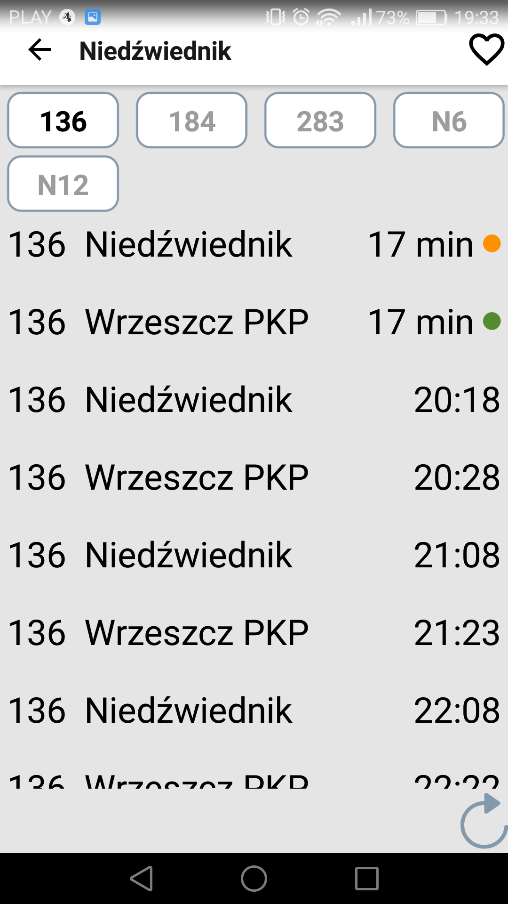

W widoku *Rozkład linii* po wyborze określonej linii, aplikacja przełączy na widok, w którym są przystanki na danej linii. Kierunek jazdy można wybrać po nazwie, klikając jeden z dwóch przycisków przypiętych do góry widoku. Po wyborze przystanku w interesującym nas kierunku, przejdziemy do widoku odjazdów z tego przystanku. Domyślnie odjazdy są wyświetlane tylko dla wybranej linii, ale za pomocą przycisków u góry ekranu istnieje możliwość włączenia wszystkich pozostałych linii odjeżdżających z tego przystanku.

W menu *Mapa* przy użyciu [API MapBox](https://www.mapbox.com/maps/) został zaimplementowany widok mapy bazującej na [Open Street Map](https://www.openstreetmap.org/#map=13/54.3850/18.6010). Na mapie zostały umieszczone znaczniki wszystkich przystanków oraz biletomatów na terenie Trójmiasta, oznaczonych odpowiednimi ikonami: przystanku autobusowego, tramwajowego oraz biletomatu. 

  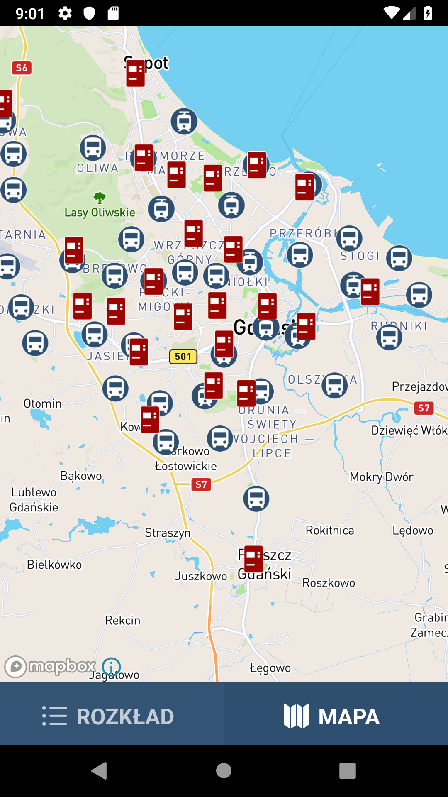
  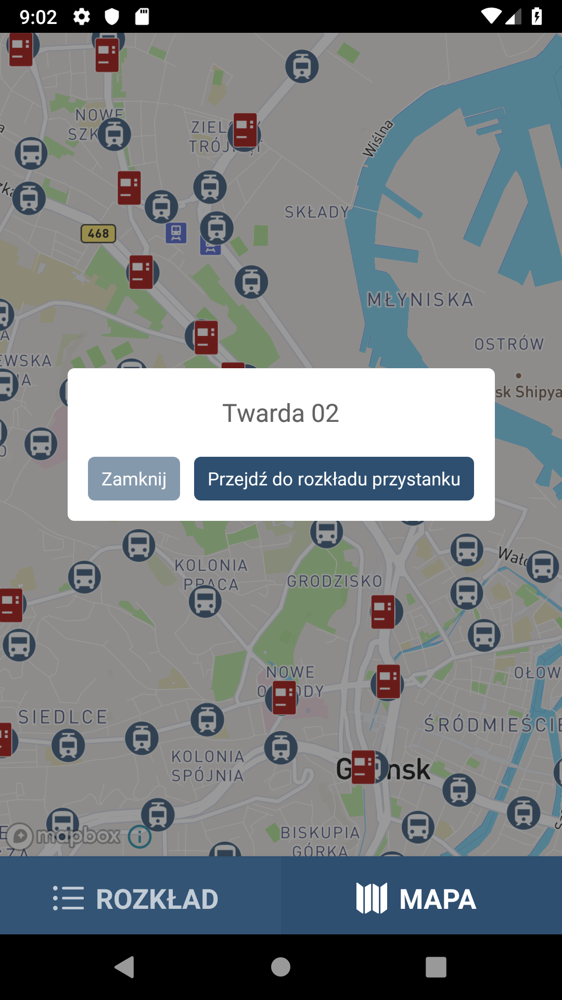
  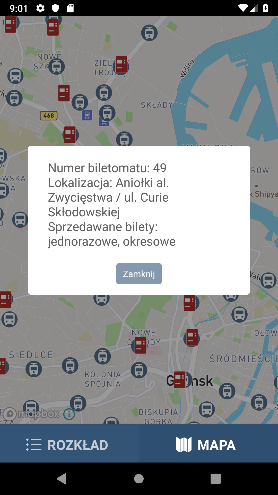

Kliknięcie przystanku wyświetla komunikat z jego nazwą oraz przyciskiem umożliwiającym przejście do widoku odbywających się z niego odjazdów. Kliknięcie biletomatu wyświetla z kolei jego szczegóły: nr, położenie oraz rodzaje sprzedawanych biletów. 
Również jest możliwość podglądu trasy wybranego autobusu. 

  
  
  

Od 10 maja są udostepniane GPS'y.

  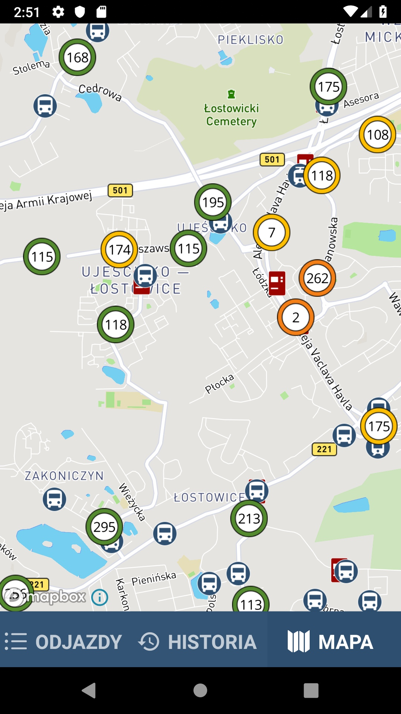

